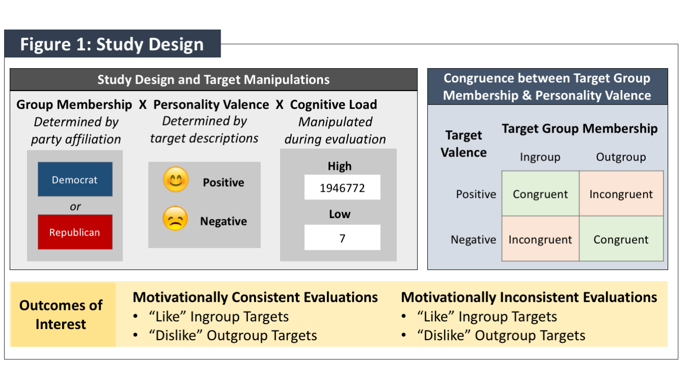

```{r global, include=FALSE, echo = FALSE}
### Load library ####
require(dplyr) || {install.packages("dplyr"); require(dplyr)}
require(tidyr) || {install.packages("tidyr"); require(tidyr)}
require(reshape2) || {install.packages("reshape2"); require(reshape2)}
require(geepack) || {install.packages("geepack"); require(geepack)}
require(ggplot2) || {install.packages("ggplot2"); require(ggplot2)}
require(lme4) || {install.packages("lme4"); require(lme4)}
require(lmerTest) || {install.packages("lmerTest"); require(lmerTest)}
require(stats4) || {install.packages("stats4"); require(stats4)}
require(doBy) || {install.packages("doBy"); require(doBy)}
require(lsmeans) || {install.packages("lsmeans"); require(lsmeans)}
require(data.table) || {install.packages("data.table"); require(data.table)}
require(tibble) || {install.packages("tibble"); require(tibble)}
require(forcats) || {install.packages("forcats"); require(forcats)}
require(gridExtra) || {install.packages("gridExtra"); require(gridExtra)}
require(RColorBrewer) || {install.packages("RColorBrewer"); require(RColorBrewer)}
require(ggrepel) || {install.packages("ggrepel"); require(ggrepel)}
require(DT) || {install.packages("DT"); require(DT)}
require(emmeans) || {install.packages("emmeans"); require(emmeans)}
require(margins) || {install.packages("margins"); require(margins)}
require(paramtest) || {install.packages("paramtest"); require(paramtest)}
require(pwr) || {install.packages("pwr"); require(pwr)}
require(nlme) || {install.packages("nlme"); require(nlme)}

### Other set-up features ####
options(dplyr.summarise.inform = FALSE)
cbPalette <- c("#0072B2", "#56B4E9", "#D55E00", "#E69F00")

``` 

```{r setup, include=FALSE}
knitr::opts_chunk$set(echo = TRUE)
```

***

## Introduction
The following example provides a summary of a study I completed as part of my dissertation for a Doctor of Philosophy in Psychology. Although the research is a psychological study, the methods and analytical approach are generalizable. Due to privacy concerns, I cannot share the raw data from the study, only aggregated and pre-processed results. However, the sections below included supplementary coding examples that illustrate how the raw data were preprocesses and analyzed.


**Supplementary Research Background (Non-essential and can be skipped)** 

<details>
  <summary>Click to expand!</summary>

  
Intergroup conflict characterized by explicit antagonism toward outgroup members and perceptions of outgroup threat elicits psychological processes that that entrench prejudice and further intergroup divide. As part of a series of studies on intergroup conflict, I conducted an experiment on the role of effortful, cognitive processes in maintaining negative perceptions of outgroup members and positive perceptions of outgroup members. 

Effortful cognitive processes—known as “cognitive control”— help people align their behavior with their goals, particularly when they are confronted by challenges, biases, or tempting alternatives. Research on control has predominately focused on its positive benefits. For example, a student who wants to perform well on an upcoming exam may exert cognitive control when they forgo an evening with friends to study for their test. In intergroup conflict, cognitive control is associated with the reduction of psychological biases, like prejudice. When individuals hold strongly held, egalitarian beliefs, their behavior is less influenced by unconscious biases, like stereotypes. Indeed, the failure to engage in effortful, control processes is associated with negative attitudes toward outgroup members and positive bias toward ingroup members—a phenomenon researchers call “effortless bias.”  

“Effortless bias” captures an important dynamic of intergroup conflict—however, it alone cannot explain why extreme intergroup conflict is so resistant to de-escalation. In these extreme contexts, bias is the goal and serves to galvanize ingroup members against outgroup threat. Consequently, when intergroup conflicts are characterized by explicit antagonism and perceptions of outgroup threat, individuals may engage cognitive control in ways that maintain biased evaluations of in- and outgroup targets. In other words, intergroup bias becomes effortful.

The current study tests this “effortful bias” account in the context of American political conflict. Specifically, the study examines whether individuals engage cognitive control processes to maintain negative evaluations of outgroup targets and positive evaluations of ingroup targets. I employed an experimental manipulation to disrupt participants’ ability to engage cognitive control processes while they performed a social evaluation task, in which they judged political in- and outgroup targets. The results were marginally significant and directionally support the prediction that individuals engage in control processes to maintain motivationally consistent evaluations of political group targets. The research underscores the role of “effortful bias” in maintaining intergroup conflict and has strong implications for behavioral de-escalation interventions.

</details>


***

## Section 1: Study Thesis, Predictions, & Procedure


**Premise:** In intergroup conflict characterized by explicit and extreme prejudice, individuals are motivated to maintain positive evaluations of ingroup members and negative evaluations of outgroup members. American political polarization is an accessible and relevant context to examine the role of effortful, control processes in maintaining these biased evaluations of in- and outgroup targets. See Figure 1 for the study design. 

**Thesis:** Individuals will engage in effortful, control processing to maintain motivationally consistent evaluations of political in- and outgroup members to the extent that (a) they cannot maintain biased evaluations through relatively automatic processing alone and (b) they hold strong negative attitudes toward the political outgroup.

**Study Hypothesis: Participants under high versus low cognitive load will be less likely to make motivationally consistent evaluations of targets whose group membership conflicts with other evaluative cues. Motivationally consistent evaluations of congruent targets will not differ between high and low load.**

**Study Procedure:** The study recruited American participants (n = 156) who strongly identified as either Democratic or Republican. This recruiting strategy ensured that participants would be motivated to positively evaluate ingroup members and negatively evaluate outgroup members. The study used a social evaluation paradigm, during which participants evaluated whether they liked or disliked other people (“targets”) they encountered in an earlier portion of the study. The stimuli were systematically manipulated to induce the need for cognitive control during the evaluation task. In certain conditions, participants needed to engage control processes to make motivationally consistent evaluations of targets based on their political party and previously learned information. The study also manipulated cognitive load, which systematically disrupted participants’ ability to engage control during the evaluation task. Consequently, participants’ ability to make motivationally consistent evaluations during trials that required control processing would be impaired in the high- versus low-load condition.

<center>
{width=50%}

</center>

[<a href="#top">Back to top</a>]{style="float:right"}

***

## Section 2: Data Analyses & Results


### Analysis Procedure 

Response data were collected via an online Mouse Tracker platform, which recorded participants’ mouse trajectories and clicks during the social evaluation task. Response and trial condition data from the evaluation trials were extracted via the ‘mousetrap’ package in R (Kieslich, Henninger, Wulff, Haslbeck, & Schulte-Mecklenbeck, 2019). Consistent with previous research, responses with reaction times that exceeded three standard deviations from participant-level means were excluded from analysis. Finally, responses were excluded if the participant did not provide a target rating in the self-paced survey that followed the evaluation task.

The structure of the speeded evaluation data are nested, as participants completed multiple, similarly structured trials across conditions in the evaluation task. This multilevel structure means that observations within participants are correlated, and consequently, liner models are not appropriate for analysis. Due to the multi-level structure of the data, the analyses below used Generalized Estimating Equations Logistic Regression in R using the “geeglm” function (geepack package; Halekoh, Højsgaard, & Yan, 2006).


[<a href="#top">Back to top</a>]{style="float:right"}

***

### Validation Analysis: Did the target manipulations have the intended effect?

The targets participants evaluated in the evaluation task were manipulated by valence (positive or negative) and group membership (ingroup or outgroup). To validate these manipulations, we tested both (a) whether participants were more likely to “like” positive than negative targets, and (b) whether participants were more likely to “like” in- than outgroup member targets. To account for non-independent observations of the trial data, we ran a Generalized Estimating Equations logistic regression to assess differences in participants’ likelihood of “liking” targets as a function of the targets’ group membership (dummy coded, 0: outgroup, 1: ingroup) and personality valence (dummy coded: 0: negative, 1: positive). Because of the forced-choice, “like or dislike” nature of the responses, the model assumed a binomial distribution. Since the evaluation task occurred over a relatively short, 6-minute timeframe, we did not expect low-frequency drift as might be seen over longer timeframes and specified an exchangeable correlation matrix. 

The model yielded main effects for group membership (χ2 = 7.44, p = 0.006) and valence (χ2 = 22.83, p < 0.001). The interaction between group membership and valence was not significant. These results validate the efficacy of the group membership and valence manipulations; specifically, participants were more likely to positively evaluate both (a) ingroup than outgroup member and (b) positive than negative targets. Figure 2 displays the results; error bars reflect 95% confidence intervals.


```{r warning=FALSE}
## The code to extract and preprocess the data is extensive, so I've not included it in this portfolio. If you would like to   view the code, however, I'm happy to provide it at your request. The GEE model is commented out, since I cannot upload the  raw data. The filters apply a priori exclusion criteria and limit analyses to experimental trials (excluding practice and filler trials).##


# mod1_model <- mt.data %>%
#   filter(sum_ofMismatches < 3, perc_correct_recallFin == 1,               
#          RT >= mean(RT) - 3*sd(RT), RT <= mean(RT) + 3*sd(RT),             
#          cond_task=="main", targ_type == "primary",  trial_num <= 24) %>%  
#   geeglm(like ~ factor(ingroupChr)*factor(posChr), 
#          id=SID, corstr='exchangeable',
#          family=binomial,data=., std.err="jack")

load("model1_model.rda")

## Generate Estimated Marginal Means
lsm.mod1 <- lsmeans(mod1_model, ~factor(ingroupChr)*factor(posChr), type = "response")
plot.m1 <- summary(lsm.mod1)  

## Plot Results
plot.m1 %>% 
  mutate(position_lab = 1, 
         groupChr = ingroupChr,
         Target = ifelse(groupChr == "2. Ingroup", "Ingroup Target", "Outgroup Target"),
         Target_order = ifelse(groupChr == "2. Ingroup", 1,2),
         Valence = ifelse(posChr== "2. Positive","Positive Target","Negative Target"),
         Valence_order = ifelse(posChr== "2. Positive",2,1)) %>% 
  ggplot(., aes(x=fct_reorder(Valence, Valence_order), y = prob, 
                fill=fct_reorder(Target, Target_order),  
                group=fct_reorder(Target, Target_order))) +
  geom_bar(stat="identity", position=position_dodge()) +
  geom_errorbar(aes(ymin = asymp.LCL, ymax = asymp.UCL), 
                position=position_dodge(.9), width=0)+      #, width=0) + 
  labs(title="Figure 2: Validate Effect of Target Manipulations",
       subtitle="Effects of Target Group Membership and Personality Valence") +
  labs(x="Target Personality Valence", y="Probability") +
  labs(fill="Target Group Membership", linetype = "Evaluation") +
  theme(plot.title = element_text(size=14, face = "bold"),
        plot.subtitle=element_text(size=14, face="italic"),
        axis.title.x = element_text(size=12,  face = "bold"),
        axis.title.y = element_text(size=12,  face = "bold"),
        axis.text=element_text(size=12, 
                               colour = "black", 
                               hjust = .5),
        legend.title = element_text(face = "bold", size = 14)) +
  theme(panel.grid.minor = element_blank(),
        panel.grid.major = element_blank()) +
  scale_fill_manual(values=cbPalette[c(1, 3)]) +
  scale_color_manual(values=cbPalette[c(1, 3)]) 


```

[<a href="#top">Back to top</a>]{style="float:right"}

***

### Primary Analysis: Did high cognitive load reduce motivationally consistent evaluations of incongruent targets? 

Our main prediction was that high cognitive load would disrupt participant’s ability to make motivationally consistent evaluations of targets whose group membership was misaligned with previously learned valence associations. To this end, we ran a second Generalized Estimating Equations logistic regression to assess the likelihood of making motivationally consistent evaluations as a function of cognitive load and group membership by valence congruence. Motivationally consistent evaluations were coded as a binary outcome indicated as consistent (1: like ingroup target, dislike outgroup target) or inconsistent (0: dislike ingroup target, like outgroup target). Cognitive load was dummy coded (0: low, 1: high). Target congruence was dummy coded to reflect two levels: congruent (0: positive ingroup targets and negative outgroup targets), and incongruent (1: negative ingroup targets and positive outgroup targets). Finally, the model included an interaction term for round to indicate repeated evaluations. 

We expected that participants in the high load condition would make less motivationally consistent evaluations of incongruent, but not congruent, targets. Directionally consistent with our predictions, the model yielded a marginally significant interaction between cognitive load, target congruence, and round (χ2 = 3.23, p = 0.072). However, post-hoc analyses showed that, in the initial round of the task, the interaction between cognitive load and alignment was driven by differences for both congruent and incongruent targets. We only predicted changes in incongruent targets, but the interaction was driven by high-load participants being both (a) more likely to make motivationally consistent evaluations of congruent targets and (b) less likely to make motivationally consistent evaluations of congruent targets (Figure 3). Neither effect alone was statistically significant. Further, the difference by cognitive load decreased over time, such that low-load responses came to look more like high-load responses as the task progressed (Figure 4). Error bars reflect 95% confidence intervals.


```{r warning=FALSE}
## The GEE model is commented out, since I cannot upload the  raw data. The filters apply a priori exclusion criteria and limit analyses to experimental trials (excluding practice and filler trials).##


# mod2_model <- mt.data %>%
#   filter(sum_ofMismatches < 3, perc_correct_recallFin == 1,    
#          RT >= mean(RT) - 3*sd(RT), RT <= mean(RT) + 3*sd(RT), 
#          cond_task=="main", targ_type == "primary",  trial_num <= 24) %>%  
#   geeglm(MC_eval ~ factor(clChr)*factor(conflictChr)*evalRound, 
#          id=SID, corstr='exchangeable',
#          family=binomial,data=., std.err="jack")

load("model2_model.rda")

## Generate Estimated Marginal Means
lsm.mod2 <- lsmeans(mod2_model, ~factor(clChr)*factor(conflictChr)*evalRound, type = "response",
                        at = list(evalRound = c(1, 4))) 
plot.m2 <- summary(lsm.mod2)  

## Plot Results
plot.m2 %>% 
  filter(evalRound == 1) %>% 
  mutate(position_lab = 1, 
         Round = paste0("Evaluation at Round ", evalRound),
         CogLoad = ifelse(clChr == "2. High", "High Cognitive Load", "Low Cognitive Load"),
         CogLoad_order = ifelse(clChr == "2. High", 2, 1),
         Conflict = ifelse(conflictChr == "Congruent", "Congruent Target",
                           "Incongruent Target"),
         Conflict_order = ifelse(conflictChr == "Congruent",1, 2)) %>% 
  ggplot(., aes(x=fct_reorder(CogLoad, CogLoad_order), y = prob, 
                fill=fct_reorder(Conflict, Conflict_order), 
                group=fct_reorder(Conflict, Conflict_order))) +
  geom_bar(stat="identity", position=position_dodge()) +
  geom_errorbar(aes(ymin = asymp.LCL, ymax = asymp.UCL), 
                position=position_dodge(.9), width=0) + 
  labs(title="Figure 3: Motivationally Consistent Evaluations (MCE)",
       subtitle="Effect of Cognitive Load and Target Congruence during the \nFirst Round of the Evaluation Task") +
  labs(x="", y="Probability of MCE: Liking Ingroup Memebers \nand Disliking Outgroup Members") +
  labs(fill="Target Congruence", linetype = "Evaluation") +
  theme(plot.title = element_text(size=14, face = "bold"),
        plot.subtitle=element_text(size=14, face="italic"),
        axis.title.x = element_text(size=12,  face = "bold"),
        axis.title.y = element_text(size=12,  face = "bold"),
        axis.text=element_text(size=12, 
                               colour = "black", 
                               hjust = .5),
        legend.title = element_text(face = "bold", size = 14)) +
  theme(panel.grid.minor = element_blank(),
        panel.grid.major = element_blank()) +
  coord_cartesian(ylim=c(0, 1))+
  scale_fill_manual(values=cbPalette[c(1,3)]) +
  scale_color_manual(values=cbPalette[c(1,3)]) 


## Post-hoc effects (first round)
# contrast.m2 <- lsmeans(mod2_model, ~factor(clChr)|factor(conflictChr), type = "response", 
#                             at = list(evalRound = c(1)))
# contrast(contrast.m2, interaction = "pairwise")   


## Over time
## Generate Estimated Marginal Means
lsm.mod2.v2 <- lsmeans(mod2_model, ~factor(clChr)*factor(conflictChr)*evalRound, type = "response",
                        at = list(evalRound = c(1,4))) 
plot.m2.v2 <- summary(lsm.mod2.v2)

plot.m2.v2 %>% 
  mutate(position_lab = 1, 
         CogLoad = ifelse(clChr == "2. High", "High Cognitive Load", "Low Cognitive Load"),
         CogLoad_order = ifelse(clChr == "2. High", 2, 1),
         Conflict = ifelse(conflictChr == "Congruent", "Congruent Target",
                           "Incongruent Target"),
         Conflict_order = ifelse(conflictChr == "Congruent",1, 2)) %>% 
  ggplot(., aes(x=evalRound, y = prob, 
                color=fct_reorder(Conflict, Conflict_order),
                group=interaction( fct_reorder(Conflict, Conflict_order),fct_reorder(CogLoad, CogLoad_order)) )) +
  geom_line(aes(linetype = fct_reorder(CogLoad, CogLoad_order)), position = position_dodge(width=.05)) + 
  geom_point( position = position_dodge(width=.05)) +
  geom_pointrange(aes(ymin=asymp.LCL, ymax=asymp.UCL), position = position_dodge(width=.05))+
  labs(title="Figure 4: Motivationally Consistent Evaluations (MCE)",
       subtitle="Effect of Cognitive Load and Group Membership by Valence Alignment \n Across Rounds of Evaluation Task") +
  labs(x="First to Last Target Evaluation", y="MCE: Probability of Liking Ingroup Memebrs \nand Disliking Outgroup Members") +
  labs(color="Target Congruence", linetype = "Cognitive Load") +
  theme(plot.title = element_text(size=14, face = "bold"),
        plot.subtitle=element_text(size=14, face="italic"),
        axis.title.x = element_text(size=12,  face = "bold"),
        axis.title.y = element_text(size=12,  face = "bold"),
        axis.text=element_text(size=12, 
                               colour = "black", 
                               hjust = .5),
        legend.title = element_text(face = "bold", size = 14)) +
  theme(panel.grid.minor = element_blank(),
        panel.grid.major = element_blank()) +
  coord_cartesian(ylim=c(0, 1))+
  scale_fill_manual(values=cbPalette[c(1,3)]) +
  scale_color_manual(values=cbPalette[c(1,3)]) 


```


[<a href="#top">Back to top</a>]{style="float:right"}

***

## Section 3: Power Analysis for Replication Study (Bootstrap Simulation)

**Analytic Procedure** 

Experimental replications are a crucial component of psychological research. They help ensure the effects in an experiment are reliable, particularly when the effect was exploratory, small, or marginal. 

As an exploratory analysis in my original study (not shown above), I tested the primary effect of interest while excluding all but the first round of evaluation trials. In other words, I only analyzed participants' initial evaluations of targets, not their evaluations in subsequent rounds. Although I originally predicted that the hypothesized effect would decay over repeated evaluations, one-off evaluation trials are not typical in social evaluation research, so the analysis was exploratory. Ultimately, I found a marginally significant interaction between cognitive load and target congruence (χ2 = 4.40, p = 0.036). Moreover, post-hoc analyses showed participants in the high load relative to the low load condition were less likely to make motivationally consistent evaluations of incongruent targets (z = 1.957, p = 0.050).

These exploratory effects are small, so a replication study is needed to assess their reliability. To determine the approximate sample size needed to detect a significant effect in a replication study, I ran simulations of bootstrapped data from the original dataset. To retain the correlated structure of the observations, I sampled clusters at the participant level across different sample sizes. Each simulation ran a logistic GEE and post-hoc analysis of the contrast of interest as described above. I ran 1000 simulations at sample sizes of n = 200, 400, 600, and 800. 

*The results suggest that I would need to collect a sample of approximately n=500 to detect a significant effect.*


```{r warning=FALSE}
## The first part of the simulation code is commented out, and the results of the simulations are loaded in part 2 instead ##

####### Part 1 (commented out) ########

# load("/Users/annehill/Dropbox/summer_2021/PRU_researchPortfolio/ppc_sty4Data_2021.06.16.rda")
# 
# # Bootstrap clusters (via participant IDs) to prepare dataset 
# id_list <- unique(sty.data$SID)
# 
# # Function to group data by SID
# get.clusters <- function(c) {
#   #c = sim_ids[[1]]
#   temp.clust <- sty.data[sty.data$SID == c,] #%>% 
# }
# 
# # Reformat DF into list clustered by SID for easier sampling
# sty.data.list <- lapply(id_list,get.clusters)
# 
# # Bind function
# clust.bind <- function(c) {
#   matrix(unlist(c),nrow=24)
# }
# 
# 
# bootstrap_styGEE <- function(simNum, sampSize) {
# 
#   # sample size and iterations
#   n <- sampSize
# 
#   boot.data.list <- sample(sty.data.list, size = n, replace = T)
# 
#   boot.data.matrix <- do.call(rbind,lapply(boot.data.list,clust.bind))
#   colnames(boot.data.matrix) <- names(sty.data)
# 
#   boot.data <- as.data.frame(boot.data.matrix, stringsAsFactors = F) %>%
#     mutate_at(vars(SID, MC_eval, evalRound, RT, sum_ofMismatches, perc_correct_recallFin), as.numeric)
# 
#   # model (MC_eval ~ cl*conflict, round = 1)
#   gee.boot <- boot.data %>%
#     filter(sum_ofMismatches < 3, perc_correct_recallFin == 1,     # general filters
#            RT >= mean(RT) - 3*sd(RT), RT <= mean(RT) + 3*sd(RT)) %>%
#     filter(cond_task=="main", targ_type == "primary", evalRound == 1) %>%         # analysis filters
#     geeglm(MC_eval ~ factor(clChr)*factor(conflictChr), id=SID, corstr='exchangeable',family=binomial,data=., std.err="jack")
# 
# 
#   # Is probability of MC_eval less in high versus low load condition for incongruent targets?
#   prep.contrast.boot <- lsmeans(gee.boot, ~factor(clChr)|factor(conflictChr), type = "response")
#   contrast.boot <- contrast(prep.contrast.boot, interaction = "pairwise")  #does mce differ by align btw CL?
#   est_cont <- summary(contrast.boot)$odds.ratio[[2]]
#   p_cont <- summary(contrast.boot)$p.value[[2]]
# 
#   output <- summary(gee.boot)$coefficients
#   coefs <- output[, 1]
#   ps <- output[, 4]
# 
# 
#   results <- c(coefs, ps, est_cont, p_cont)
#   names(results) <- c("coef_Intercept", "coef_CogLoad_High", "coef_Target_Incongruent", "coef_CogLoad_X_Target",
#                       "p_Intercept", "p_CogLoad_High", "p_Target_Incongruent", "p_CogLoad_X_Target",
#                       "contrast_est", "contrast_p")
#   return(results)
# }
# 
# 
# # Run bootstrapped simulations
# paramtest_results <- grid_search(bootstrap_styGEE,
#                                  params=list(sampSize=c(seq(200, 800, by=200))),
#                                  n.iter=1000, output='data.frame', parallel='multicore', ncpus=1)
# 
# # save(paramtest_results, file = "paramtestresults_i1000_2021.07.18.rda")

####### Part 2: Analyze and plot results #########

load("paramtestresults_i1000_2021.07.18.rda")

# Get power estimates
power_ests <- paramtest_results %>% results() %>% 
  mutate(contrast_ofInterest = factor(contrast_p)) %>% 
  group_by(sampSize.test) %>%
  summarize(power=sum(contrast_p < .05, na.rm = T) / n())

power_ests %>% 
  ggplot(., aes(x=sampSize.test, y=power)) +
  geom_point() +
  geom_line() +
  ylim(c(.25, 1)) +
  theme_minimal() +
  geom_hline(yintercept=.8, linetype="dashed", color = "black") +
  geom_text(aes(x = 750, y = 0.76, label = "80% Power"), size = 4, fontface = "italic") +
  labs(title="Simulated Power Analysis from Multilevel Bootstrapped Data", face ="bold") +
  labs(subtitle="A sample size of approximately n = 500 is needed to detect \na significant effect of interest at 80% power") +
  labs(x="Sample Size ", y="Power")+   
  theme(plot.title = element_text(hjust = 0.5, face = "bold"), 
        plot.subtitle = element_text(hjust = 0.5),
        axis.title = element_text(face = "bold"))


```

[<a href="#top">Back to top</a>]{style="float:right"}

